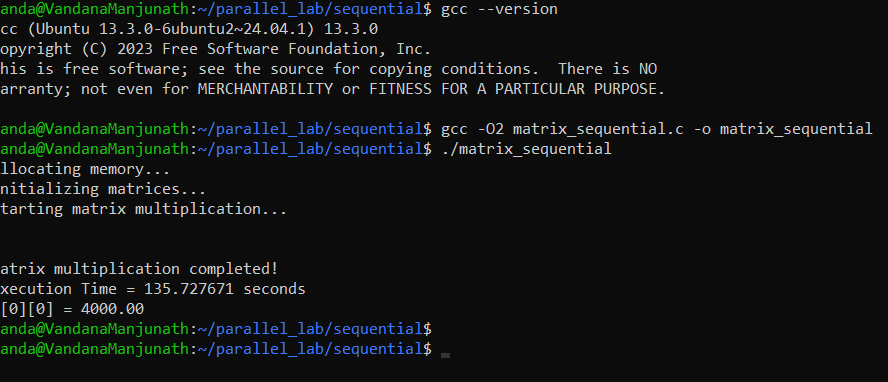
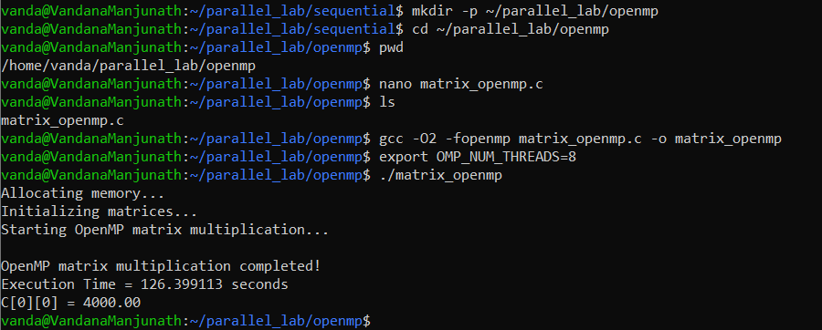
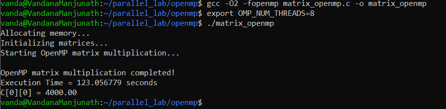
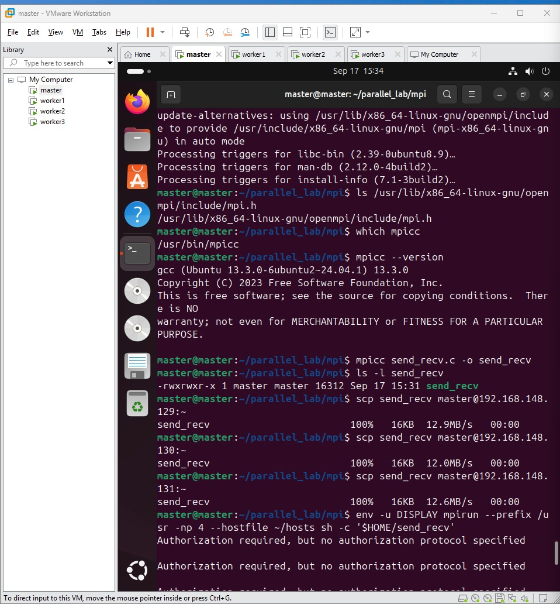
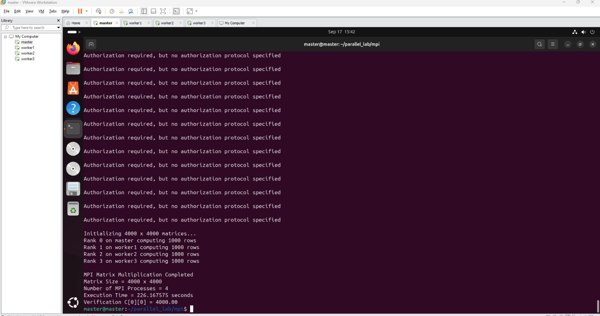
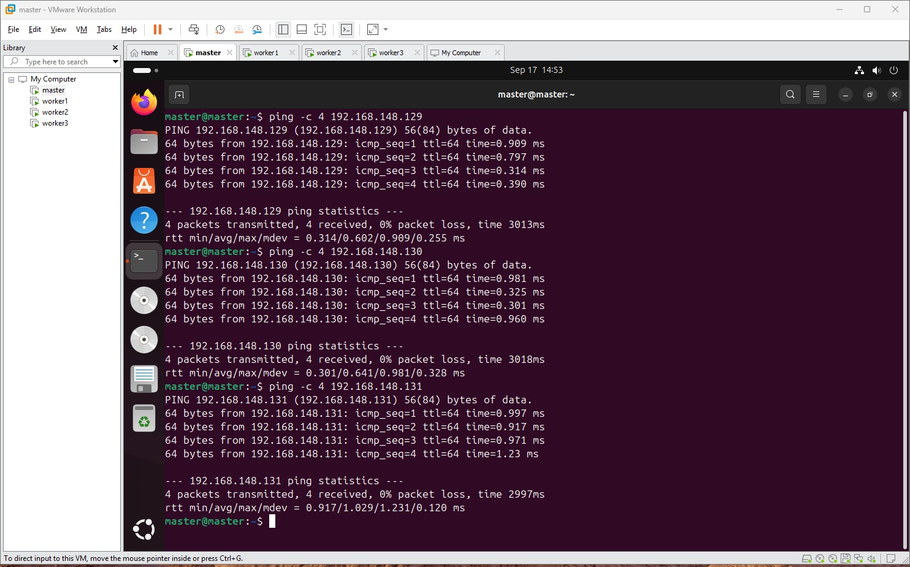
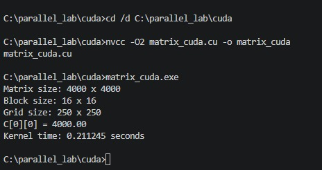
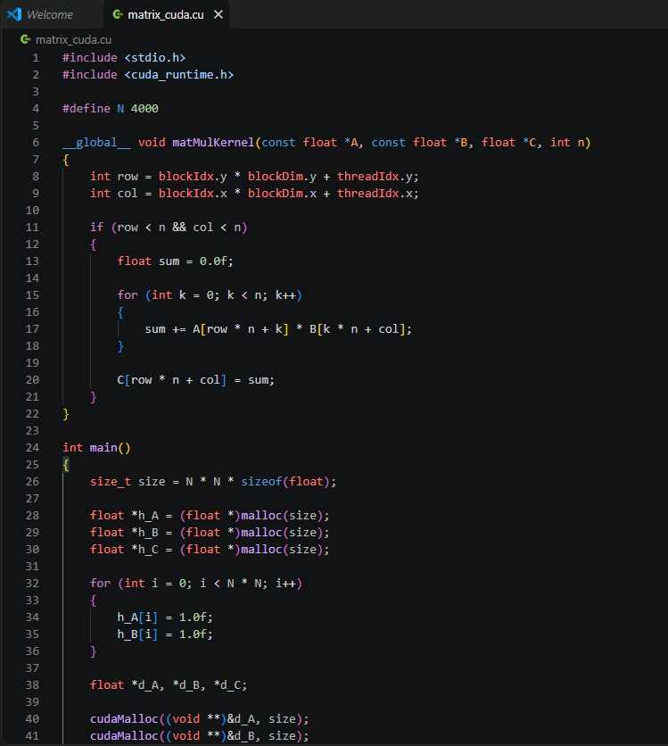
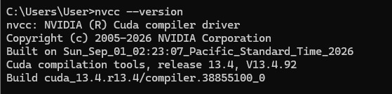

# Parallel Computing Experiment 1

## Matrix Multiplication using Sequential, OpenMP, MPI and CUDA

---

## 1. Introduction

This experiment implements the same matrix multiplication problem using four different computing models:

1. Sequential CPU execution
2. OpenMP shared-memory parallelism
3. MPI distributed-memory parallelism
4. CUDA GPU parallelism

A `4000 × 4000` matrix multiplication is performed in all four implementations.

The objective is to compare execution time and understand how different computing models affect the performance of the same mathematical operation.

All four implementations produce the same verification result:

```text
C[0][0] = 4000.00
```

---

## 2. Objective

The objectives of this experiment are:

- To implement matrix multiplication using sequential programming.
- To parallelize matrix multiplication using OpenMP.
- To distribute matrix multiplication using MPI.
- To accelerate matrix multiplication using CUDA.
- To compare the execution time of the four implementations.
- To verify that all implementations produce the same result.
- To understand the differences between sequential, shared-memory, distributed-memory and GPU computing.

---

## 3. Problem Definition

Two matrices `A` and `B` of size `4000 × 4000` are multiplied to produce matrix `C`.

The matrices are initialized as:

```text
A[i][j] = 1.0
B[i][j] = 1.0
```

Matrix multiplication is performed using:

```text
C[i][j] = Σ A[i][k] × B[k][j]
```

For `C[0][0]`, there are 4000 terms:

```text
C[0][0] = 1×1 + 1×1 + ... + 1×1
C[0][0] = 4000.00
```

---

## 4. Experimental Environment

### Hardware

- CPU-based system for Sequential and OpenMP execution
- Four Ubuntu VMware virtual machines for MPI
- NVIDIA GeForce RTX 5060 Ti GPU for CUDA

### Software and Tools

- C
- GCC
- OpenMP
- MPI / Open MPI
- CUDA Toolkit 13.4
- NVIDIA CUDA compiler (`nvcc`)
- VMware
- Ubuntu
- Windows PowerShell
- Git and GitHub

### Matrix Configuration

| Parameter | Value |
|---|---|
| Matrix A | 4000 × 4000 |
| Matrix B | 4000 × 4000 |
| Matrix C | 4000 × 4000 |
| Matrix A values | 1.0 |
| Matrix B values | 1.0 |
| Expected `C[0][0]` | 4000.00 |

---

## 5. Execution Flow

```text
Windows PowerShell
        ↓
WSL2 Ubuntu
        ↓
Sequential CPU Baseline
        ↓
OpenMP Shared Memory
        ↓
MPI Distributed Memory
        ↓
CUDA GPU Parallelism
        ↓
Results and Speedup Comparison
```

---

# 6. Sequential Matrix Multiplication

## 6.1 Description

The Sequential implementation performs matrix multiplication using a single CPU execution flow.

Three nested loops are used:

- Outer loop → rows of matrix A
- Middle loop → columns of matrix B
- Inner loop → multiplication and accumulation

This implementation provides the CPU baseline for comparison.

## 6.2 Compilation

```bash
gcc -O2 matrix_sequential.c -o matrix_sequential
```

## 6.3 Execution

```bash
./matrix_sequential
```

## 6.4 Source Code

File:

```text
sequential/matrix_sequential.c
```

```c
#include <stdio.h>
#include <stdlib.h>
#include <time.h>

#define N 4000

int main()
{
    int i, j, k;
    double *A, *B, *C;
    clock_t start, end;

    A = (double *)malloc(N * N * sizeof(double));
    B = (double *)malloc(N * N * sizeof(double));
    C = (double *)malloc(N * N * sizeof(double));

    if (A == NULL || B == NULL || C == NULL)
    {
        printf("Memory allocation failed\n");
        return 1;
    }

    printf("Initializing %d x %d matrices...\n", N, N);

    for (i = 0; i < N; i++)
    {
        for (j = 0; j < N; j++)
        {
            A[i * N + j] = 1.0;
            B[i * N + j] = 1.0;
            C[i * N + j] = 0.0;
        }
    }

    start = clock();

    for (i = 0; i < N; i++)
    {
        for (j = 0; j < N; j++)
        {
            for (k = 0; k < N; k++)
            {
                C[i * N + j] +=
                    A[i * N + k] *
                    B[k * N + j];
            }
        }
    }

    end = clock();

    printf("\nSequential Matrix Multiplication Completed\n");
    printf("Matrix Size = %d x %d\n", N, N);
    printf("Execution Time = %f seconds\n",
           (double)(end - start) / CLOCKS_PER_SEC);
    printf("Verification C[0][0] = %.2f\n", C[0]);

    free(A);
    free(B);
    free(C);

    return 0;
}
```

## 6.5 Recorded Result

```text
Sequential Matrix Multiplication Completed
Matrix Size = 4000 x 4000
Execution Time = 135.727671 seconds
Verification C[0][0] = 4000.00
```

## 6.6 Screenshot



---

# 7. OpenMP Matrix Multiplication

## 7.1 Description

OpenMP is used to parallelize matrix multiplication on a shared-memory CPU.

The outer loop is parallelized using:

```c
#pragma omp parallel for private(j, k)
```

For this experiment, 8 OpenMP threads were used.

## 7.2 OpenMP Configuration

```bash
export OMP_NUM_THREADS=8
```

Verification:

```bash
echo $OMP_NUM_THREADS
```

Expected output:

```text
8
```

## 7.3 Compilation

```bash
gcc -O2 -fopenmp matrix_openmp.c -o matrix_openmp
```

## 7.4 Execution

```bash
./matrix_openmp
```

## 7.5 Source Code

File:

```text
openmp/matrix_openmp.c
```

```c
#include <stdio.h>
#include <stdlib.h>
#include <omp.h>

#define N 4000

int main()
{
    int i, j, k;
    double *A, *B, *C;
    double start, end;

    A = (double *)malloc(N * N * sizeof(double));
    B = (double *)malloc(N * N * sizeof(double));
    C = (double *)malloc(N * N * sizeof(double));

    if (A == NULL || B == NULL || C == NULL)
    {
        printf("Memory allocation failed\n");
        return 1;
    }

    for (i = 0; i < N; i++)
    {
        for (j = 0; j < N; j++)
        {
            A[i * N + j] = 1.0;
            B[i * N + j] = 1.0;
            C[i * N + j] = 0.0;
        }
    }

    start = omp_get_wtime();

    #pragma omp parallel for private(j, k)
    for (i = 0; i < N; i++)
    {
        for (j = 0; j < N; j++)
        {
            for (k = 0; k < N; k++)
            {
                C[i * N + j] +=
                    A[i * N + k] *
                    B[k * N + j];
            }
        }
    }

    end = omp_get_wtime();

    printf("OpenMP Matrix Multiplication Completed\n");
    printf("Matrix Size = %d x %d\n", N, N);
    printf("Number of Threads Used = %d\n", omp_get_max_threads());
    printf("Execution Time = %f seconds\n", end - start);
    printf("Verification C[0][0] = %.2f\n", C[0]);

    free(A);
    free(B);
    free(C);

    return 0;
}
```

## 7.6 Recorded Result

```text
OpenMP Matrix Multiplication Completed
Matrix Size = 4000 x 4000
Number of Threads Used = 8
Execution Time = 123.056779 seconds
Verification C[0][0] = 4000.00
```

## 7.7 Screenshots





---

# 8. MPI Matrix Multiplication

## 8.1 Description

MPI (Message Passing Interface) is used to implement distributed-memory matrix multiplication.

The matrix rows are divided among MPI processes.

The implementation uses:

- `MPI_Scatter()` to distribute rows of matrix A.
- `MPI_Bcast()` to broadcast matrix B.
- Local matrix multiplication on each process.
- `MPI_Gather()` to collect the partial results.
- `MPI_Barrier()` for synchronization.

Four MPI processes were used across four Ubuntu VMware virtual machines.

## 8.2 MPI Host Configuration

File:

```text
mpi/hosts
```

Contents:

```text
master slots=1
worker1 slots=1
worker2 slots=1
worker3 slots=1
```

MPI process arrangement:

```text
master
worker1
worker2
worker3
```

## 8.3 MPI Source Code

File:

```text
mpi/matrix_mpi.c
```

```c
#include <stdio.h>
#include <stdlib.h>
#include <mpi.h>
#include <unistd.h>

#define N 4000

int main(int argc, char *argv[])
{
    int rank, size;
    int i, j, k;
    int rows_per_process;
    char hostname[256];

    double *A = NULL;
    double *B = NULL;
    double *C = NULL;
    double *local_A;
    double *local_C;

    double start, end;

    MPI_Init(&argc, &argv);

    MPI_Comm_rank(MPI_COMM_WORLD, &rank);
    MPI_Comm_size(MPI_COMM_WORLD, &size);

    gethostname(hostname, sizeof(hostname));

    if (N % size != 0)
    {
        if (rank == 0)
            printf("Matrix size must be divisible by number of processes.\n");

        MPI_Finalize();
        return 0;
    }

    rows_per_process = N / size;

    local_A = (double *)malloc(
        rows_per_process * N * sizeof(double));

    local_C = (double *)malloc(
        rows_per_process * N * sizeof(double));

    B = (double *)malloc(
        N * N * sizeof(double));

    if (rank == 0)
    {
        A = (double *)malloc(N * N * sizeof(double));
        C = (double *)malloc(N * N * sizeof(double));

        printf("Initializing %d x %d matrices...\n", N, N);

        for (i = 0; i < N; i++)
        {
            for (j = 0; j < N; j++)
            {
                A[i * N + j] = 1.0;
                B[i * N + j] = 1.0;
                C[i * N + j] = 0.0;
            }
        }
    }

    MPI_Barrier(MPI_COMM_WORLD);
    start = MPI_Wtime();

    MPI_Scatter(
        A,
        rows_per_process * N,
        MPI_DOUBLE,
        local_A,
        rows_per_process * N,
        MPI_DOUBLE,
        0,
        MPI_COMM_WORLD);

    MPI_Bcast(
        B,
        N * N,
        MPI_DOUBLE,
        0,
        MPI_COMM_WORLD);

    printf("Rank %d on %s computing %d rows\n",
           rank, hostname, rows_per_process);

    for (i = 0; i < rows_per_process; i++)
    {
        for (j = 0; j < N; j++)
        {
            local_C[i * N + j] = 0.0;

            for (k = 0; k < N; k++)
            {
                local_C[i * N + j] +=
                    local_A[i * N + k] *
                    B[k * N + j];
            }
        }
    }

    MPI_Gather(
        local_C,
        rows_per_process * N,
        MPI_DOUBLE,
        C,
        rows_per_process * N,
        MPI_DOUBLE,
        0,
        MPI_COMM_WORLD);

    MPI_Barrier(MPI_COMM_WORLD);
    end = MPI_Wtime();

    if (rank == 0)
    {
        printf("\nMPI Matrix Multiplication Completed\n");
        printf("Matrix Size = %d x %d\n", N, N);
        printf("Number of MPI Processes = %d\n", size);
        printf("Execution Time = %f seconds\n", end - start);
        printf("Verification C[0][0] = %.2f\n", C[0]);

        free(A);
        free(C);
    }

    free(B);
    free(local_A);
    free(local_C);

    MPI_Finalize();
    return 0;
}
```

## 8.4 Recorded Result

```text
MPI Matrix Multiplication Completed
Matrix Size = 4000 x 4000
Number of MPI Processes = 4
Execution Time = 226.167575 seconds
Verification C[0][0] = 4000.00
```

## 8.5 MPI Screenshots







---

# 9. CUDA Matrix Multiplication

## 9.1 Description

CUDA is used to perform matrix multiplication on an NVIDIA GPU.

The CUDA implementation uses:

- Host memory for matrices A, B and C.
- Device memory for GPU matrices.
- A CUDA kernel for parallel matrix multiplication.
- CUDA threads to calculate output matrix elements.
- CUDA events to measure execution time.

GPU:

```text
NVIDIA GeForce RTX 5060 Ti
```

CUDA Toolkit:

```text
13.4
```

## 9.2 CUDA Execution Configuration

```text
Matrix Size = 4000 × 4000
Block Size = 16 × 16 threads
Grid Size = 250 × 250 blocks
```

Each block contains:

```text
16 × 16 = 256 threads
```

Total blocks:

```text
250 × 250 = 62,500 blocks
```

Logical CUDA thread instances:

```text
62,500 × 256 = 16,000,000
```

These logical threads correspond conceptually to the `4000 × 4000` output elements.

## 9.3 CUDA Compilation

```bash
nvcc -O2 matrix_cuda.cu -o matrix_cuda
```

## 9.4 CUDA Execution

```bash
./matrix_cuda
```

## 9.5 Source Code

File:

```text
cuda/matrix_cuda.cu
```

```cpp
#include <stdio.h>
#include <stdlib.h>
#include <cuda_runtime.h>

#define N 4000

__global__ void matMulKernel(float *A, float *B, float *C, int n)
{
    int row = blockIdx.y * blockDim.y + threadIdx.y;
    int col = blockIdx.x * blockDim.x + threadIdx.x;

    if (row < n && col < n)
    {
        float sum = 0.0f;

        for (int k = 0; k < n; k++)
        {
            sum += A[row * n + k] *
                   B[k * n + col];
        }

        C[row * n + col] = sum;
    }
}

int main()
{
    size_t bytes = N * N * sizeof(float);

    float *h_A, *h_B, *h_C;
    float *d_A, *d_B, *d_C;

    h_A = (float *)malloc(bytes);
    h_B = (float *)malloc(bytes);
    h_C = (float *)malloc(bytes);

    if (h_A == NULL || h_B == NULL || h_C == NULL)
    {
        printf("Host memory allocation failed\n");
        return 1;
    }

    for (int i = 0; i < N * N; i++)
    {
        h_A[i] = 1.0f;
        h_B[i] = 1.0f;
        h_C[i] = 0.0f;
    }

    cudaMalloc((void **)&d_A, bytes);
    cudaMalloc((void **)&d_B, bytes);
    cudaMalloc((void **)&d_C, bytes);

    cudaEvent_t totalStart, totalStop;
    cudaEvent_t kernelStart, kernelStop;

    cudaEventCreate(&totalStart);
    cudaEventCreate(&totalStop);
    cudaEventCreate(&kernelStart);
    cudaEventCreate(&kernelStop);

    cudaEventRecord(totalStart);

    cudaMemcpy(d_A, h_A, bytes, cudaMemcpyHostToDevice);
    cudaMemcpy(d_B, h_B, bytes, cudaMemcpyHostToDevice);

    dim3 block(16, 16);
    dim3 grid((N + block.x - 1) / block.x,
              (N + block.y - 1) / block.y);

    cudaEventRecord(kernelStart);

    matMulKernel<<<grid, block>>>(d_A, d_B, d_C, N);

    cudaEventRecord(kernelStop);
    cudaEventSynchronize(kernelStop);

    cudaMemcpy(h_C, d_C, bytes, cudaMemcpyDeviceToHost);

    cudaEventRecord(totalStop);
    cudaEventSynchronize(totalStop);

    float kernelTime = 0.0f;
    float totalTime = 0.0f;

    cudaEventElapsedTime(&kernelTime,
                         kernelStart, kernelStop);

    cudaEventElapsedTime(&totalTime,
                         totalStart, totalStop);

    printf("CUDA Matrix Multiplication Completed\n");
    printf("Matrix Size = %d x %d\n", N, N);
    printf("Grid Size = %d x %d blocks\n",
           grid.x, grid.y);
    printf("Block Size = %d x %d threads\n",
           block.x, block.y);
    printf("Kernel Execution Time = %.6f seconds\n",
           kernelTime / 1000.0f);
    printf("Total CUDA Phase Time = %.6f seconds\n",
           totalTime / 1000.0f);
    printf("Verification C[0][0] = %.2f\n",
           h_C[0]);

    cudaFree(d_A);
    cudaFree(d_B);
    cudaFree(d_C);

    free(h_A);
    free(h_B);
    free(h_C);

    cudaEventDestroy(totalStart);
    cudaEventDestroy(totalStop);
    cudaEventDestroy(kernelStart);
    cudaEventDestroy(kernelStop);

    return 0;
}
```

## 9.6 Recorded CUDA Result

The recorded CUDA screenshot/result shows:

```text
CUDA Matrix Multiplication Completed
Matrix Size = 4000 x 4000
Execution Time = 0.211245 seconds
Verification C[0][0] = 4000.00
```

The CUDA source itself reports both kernel execution time and total CUDA phase time. The `0.211245 s` value above is the recorded value used for the experiment comparison.

## 9.7 CUDA Screenshots








---

# 10. Performance Comparison

The following table contains the actual recorded results from this experiment.

| Implementation | Computing Model | Configuration | Execution Time (s) | Verification |
|---|---|---|---:|---:|
| Sequential | CPU | Sequential execution | **135.727671** | 4000.00 |
| OpenMP | Shared Memory | 8 CPU threads | **123.056779** | 4000.00 |
| MPI | Distributed Memory | 4 MPI processes / 4 VMware VMs | **226.167575** | 4000.00 |
| CUDA | GPU Parallelism | NVIDIA GeForce RTX 5060 Ti | **0.211245** | 4000.00 |

> **Note:** These are the recorded results from this experiment, not the reference timings from the laboratory manual.

---

# 11. Speedup Calculation

The speedup formula is:

```text
Speedup = Sequential Execution Time / Parallel Execution Time
```

## 11.1 Sequential

```text
Speedup = 135.727671 / 135.727671
        = 1.00×
```

## 11.2 OpenMP

```text
Speedup = 135.727671 / 123.056779
        ≈ 1.10×
```

## 11.3 MPI

```text
Speedup = 135.727671 / 226.167575
        ≈ 0.60×
```

## 11.4 CUDA

```text
Speedup = 135.727671 / 0.211245
        ≈ 642.40×
```

## 11.5 Speedup Table

| Implementation | Execution Time (s) | Speedup |
|---|---:|---:|
| Sequential | 135.727671 | 1.00× |
| OpenMP | 123.056779 | 1.10× |
| MPI | 226.167575 | 0.60× |
| CUDA | 0.211245 | **642.40×** |

---

# 12. Performance Analysis

## Sequential

The Sequential implementation provides the CPU baseline because the matrix multiplication is performed using one CPU execution flow.

## OpenMP

OpenMP uses 8 CPU threads to distribute the outer-loop iterations.

Recorded times:

```text
Sequential = 135.727671 seconds
OpenMP     = 123.056779 seconds
```

OpenMP achieved approximately `1.10×` speedup over the Sequential implementation in the recorded experiment.

## MPI

MPI distributes the computation across four MPI processes running on four Ubuntu VMware virtual machines.

Recorded times:

```text
Sequential = 135.727671 seconds
MPI        = 226.167575 seconds
```

The MPI execution was slower than the Sequential execution in this recorded environment. Communication, synchronization and virtual-machine/network overhead contribute to the measured execution time.

## CUDA

CUDA achieved the lowest recorded execution time.

```text
CUDA = 0.211245 seconds
```

The GPU implementation uses a large number of logical CUDA threads to calculate output elements in parallel.

Using the recorded time, the CUDA implementation achieved approximately:

```text
642.40×
```

the Sequential baseline performance.

---

# 13. Correctness Verification

All four implementations initialize matrices A and B with `1.0`.

For each output element:

```text
C[i][j] = 1 + 1 + 1 + ... + 1
```

There are 4000 terms, therefore:

```text
C[i][j] = 4000.00
```

Recorded verification:

| Implementation | `C[0][0]` |
|---|---:|
| Sequential | 4000.00 |
| OpenMP | 4000.00 |
| MPI | 4000.00 |
| CUDA | 4000.00 |

All four implementations therefore produced the expected mathematical result.

---

# 14. Repository Structure

```text
PGC-EXPERIMENT-1/
│
├── README.md
│
├── sequential/
│   └── matrix_sequential.c
│
├── openmp/
│   └── matrix_openmp.c
│
├── mpi/
│   ├── matrix_mpi.c
│   └── hosts
│
├── cuda/
│   └── matrix_cuda.cu
│
├── results/
│   └── performance_comparison.md
│
└── screenshots/
    │
    ├── sequential/
    │   └── sequential-result.png
    │
    ├── openmp/
    │   ├── 01-openmp-setup-and-result.png
    │   └── 02-openmp-final-result.png
    │
    ├── mpi/
    │   ├── 01-mpi-vmware-setup-and-copy.png
    │   ├── 02-mpi-vmware-successful-result.png
    │   └── 03-mpi-vmware-network-connectivity.png
    │
    └── cuda/
        ├── 01-cuda-matrix-multiplication-result.jpeg
        ├── 02-cuda-source-code.jpeg
        ├── 03-cuda-version.jpeg
        └── 04-nvidia-smi-gpu-details.jpeg
```

---

# 15. Technologies Used

| Technology | Purpose |
|---|---|
| C | Sequential, OpenMP and MPI implementations |
| OpenMP | Shared-memory CPU parallelism |
| MPI | Distributed-memory parallelism |
| CUDA | GPU parallel computing |
| GCC | C compilation |
| Open MPI | MPI implementation |
| CUDA Toolkit 13.4 | CUDA development |
| NVIDIA GeForce RTX 5060 Ti | GPU execution |
| Ubuntu | Linux execution environment |
| VMware | MPI virtual-machine environment |
| PowerShell | Windows command-line environment |
| Git | Version control |
| GitHub | Source-code repository |

---

# 16. Experiment Evidence

## Sequential


## OpenMP


## MPI


## CUDA


---

# 17. Troubleshooting

| Problem | Action |
|---|---|
| WSL command not found | Verify WSL using `wsl --status` and check distributions using `wsl -l -v`. |
| Ubuntu does not start | Restart WSL using `wsl --shutdown` and launch it again. |
| `gcc` command not found | Install GCC/build-essential inside Ubuntu. |
| OpenMP compilation fails | Ensure the compilation command contains `-fopenmp`. |
| OpenMP uses fewer threads | Check `nproc` and `echo $OMP_NUM_THREADS`. |
| MPI communication fails | Verify all VMware nodes have network connectivity and SSH access. |
| MPI host not found | Check the `mpi/hosts` file and the configured host names. |
| `nvcc` command not found | Verify that CUDA Toolkit is installed and `nvcc` is available in PATH. |
| GPU not detected | Run `nvidia-smi` and verify that the NVIDIA GPU is recognized. |
| CUDA compilation fails | Check CUDA Toolkit installation and compile the `.cu` file using `nvcc`. |

---

# 18. Important Implementation Note

The Sequential, OpenMP and MPI implementations use:

```c
double
```

for matrix values.

The CUDA implementation uses:

```cpp
float
```

for matrix values.

Therefore, the recorded performance comparison reflects the actual implementations used in this experiment and is not a strictly precision-matched benchmark.

---

# 19. Conclusion

This experiment successfully implemented matrix multiplication using four different computing approaches:

1. Sequential CPU execution
2. OpenMP shared-memory parallelism
3. MPI distributed-memory parallelism
4. CUDA GPU parallelism

The experiment demonstrates the differences between sequential, shared-memory, distributed-memory and GPU-based parallel computing.

The recorded OpenMP implementation achieved a lower execution time than the Sequential implementation.

The recorded MPI implementation was slower than the Sequential implementation because of communication, synchronization and virtualization/network overhead in the experimental environment.

CUDA produced the lowest recorded execution time and demonstrated the highest performance for this workload.

Most importantly, all four implementations produced the same verification result:

```text
C[0][0] = 4000.00
```

This confirms the correctness of the matrix multiplication implementations.

---

# 20. Author

**Vandana**

Parallel Computing Lab — Experiment 1

GitHub Repository:

`https://github.com/Vandana-45/PGC-EXPERIMENT-1`
